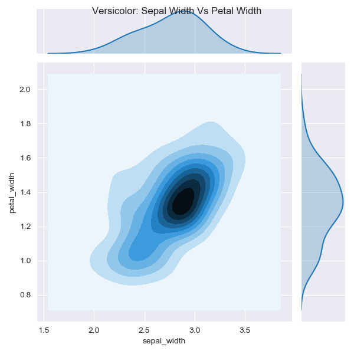

# Investigation of the Iris Dataset
## 1. 'Summary.md' Overview
This file relates to the Iris dataset and contains material outputted from 'Analysis.py'.    For more information on the background of this dataset please refer to the project    README.md file.

This section provides some structural details on the dataset, however the majority of this    file contains the results of univariate and  bivariate analysis of the dataset, based on    Matplotlib graphs created in 'Analysis.py.'

**Section 2 below presents the results of univariate analysis of histograms and Cumulative    Density Functions of the Iris species.**

**Section 3 relates to bivariate analysis of scatter plots and contour plots.**

### 1.1. Dataset Structure

Below are details relating to the structure of the Iris Dataset, providing summaries    of the 4 features.

**No. of rows/no. of columns:**  (150, 5) 

**Names of species/no. of vectors:**

Iris Virginica:     50

Iris Setosa:       50

Iris Versicolor: 50

**Column headers:** Sepal Length | Sepal Width | Petal Length | Petal Width | Species |

### 1.2. Table of Variable Statistics

|Statistic Type  |Sepal Length|Sepal Width |Petal Length |Petal Width |
|  --- |  --------- |  --------- | ----------  |  ---------  |
|Datapoint Count | 150.000000 | 150.000000 |  150.000000 | 150.000000 |
|Mean |   5.843333 |   3.054000 |    3.758667 |   1.198667 |
|Standard Deviation |   0.828066 |   0.433594 |    1.764420 |   0.763161 |
|Minimum Datapoint |   4.300000 |   2.000000 |    1.000000 |   0.100000 |
|25th Percentile |   5.100000 |   2.800000 |    1.600000 |   0.300000 |
|50th Percentile |   5.800000 |   3.000000 |    4.350000 |   1.300000 |
|75th Percentile  |   6.400000 |   3.300000 |    5.100000 |   1.800000 |
|Maximum Datapoint |   7.900000 |   4.400000 |    6.900000 |   2.500000 |
|Median Absolute Deviation|   1.037822 |   0.370651 |    1.853253 |   1.037822 |

## **2. Univariate Analyis: Histograms and PDF/CDF Functions**

## 2.1 Petal Length(PL)

**Note: CDF/PDF plots found in section 2.5.**

### Histogram of Petal Length feature:

### Setosa

From observations immediately made under univariate analysis of 'Petal Length', Iris Setosa can be distinguised from the other classes.
    Setosa is seen to have no measure of PL longer than 2cm. This is backed up by investigation of the CDF function of Setosa Petal Length in 'setosaCDF.png',    whereby Setosa PL reaches 100% probability at 1.9cm.
### Virginica and Versicolor

The histogram of Petal Length displays some minor overlap in ths Virginica and Versicolor species. Measurements for    Versicolour begin roughly at 3.2cm and end at 5.3cm. Whilst Versicolour shows a histogram curve rangin from 4.2cm to 7cm. The overlap occurs between 4cm     and 5.1cm. Looking at the CDF function of Virginica (which begins at roughly 4.4cm, it is noticed that less than 25 percent of Virginica PL vectors are less    than 5.1cm. Whilst this is a small overlap it is clear that a histogram univariate analysis of Petal Length does not adequately distinguish between Versicolor    and Virginica.

**Setosa result:** highly distinguished from other species

**Versicolor result:** moderate overlap with Virginica

**Virginica result:** moderate overlap with Versicolor

## 2.2. Petal Width (PW)

### Histogram of Petal Width feature:

### Setosa

Similarly to PL, the histogram of PW, shows Setosa    to be easily distinguished. A high peak is noted with just a few PW vectors just over 0.5cm.    Turning once again to the CDF function of Setosa, it is seen that 100 percent of Setosa values    have a PW of 0.6cm or less. From the histogram and CDF function alone, it is clear that there    is no overalap between Setosa and the other species. It is noted that roughly 55 percent of    Setosa PW vectors are between 0.2cm and 0.4cm, as noted by the sharp peak in the CDF.

### Versicolor and Virginica

Once again there is a slight overlap in Petal Width of the    remaining 2 species - this is roughly in the range of 1.2cm to 1.8cm. The distribution of both    species is very spread out, in comparison to the high peak noted in the Setosa histogram.    Looking again to the feature of Virginica as the noticably larger species in terms of PW, it is    seen that roughly 40 percent of Virginica's PW vectors are 1.8cm or less, resulting in a higher    probability of overlap with Versicolour than occurred with PL. This illustrates the benefit of    the CDF function in distinguishing these species. It is clear that because the CDF curves of both    species is more flat for PW than PL, that the overlap appeared to be less significant than it is.    This highlight the utility of a CDF curve being used in tandem with a histogram.

**Setosa result:** highly distinguished from other species

**Versicolor result:** moderate overlap with Virginica

**Virginica result:** moderate overlap with Versicolor

## 2.3. Sepal Length (SL)
### Histogram of Sepal Length feature:

### Setosa
It is immediately clear that Sepal Length     provides much less useful data in terms of distinguishing species. It is clear that the vectors     for all species measure between 4cm and 8cm. Setosa vectors range between 4cm and 6.2cm and the     bars of the Setosa histogram overlap with Versicolor, unlike with PL and PW. Looking at the CDF     graph of Setosa, 50 percent of vectors occur in the range of 5cm and 5.8cm. This equates very     closely to the CDF of Versicolor, just under 50 percent of measurements occur in the same range.     Therefore, univariate analysis of Setosa Sepal length does not distinguish it from the other species.

### Versicolor
The histogram for Versicolor SL has massive overlap with Setosa in the range     of 4.5cm to 6.2cm and with Virginica in the range 4.5cm to 7.5cm. The most significant overlap     occurs with Virginica and is concentrated in the range 5.6cm to 7cm. Looking at the CDF of     Versicolor we see that almost 70 percent of Versicolor vectors occur in this densely populated     overlap range. Therefore, Versicolor is not successfully distinguished from Setosa or Virginica looking     at SL.

### Virginica
As has already been noted, the overlap of Virginica with Versicolor in the     range 5.6cm to 7cm outlines that Virginica is also not well ditinguished through univariate     analysis of SL. Looking at the CDF, it is noted that measurements higher than the median, all     rougly occur in the range 6.6cm to 7.9cm.

**Setosa result:** moderate overlap with Versicolor

**Versicolor result:** considerable degree of overlap with Setosa and Virginica

**Virginica result:** considerable degree of overlap with Versicolor

## 2.4. Sepal Width (SW)
### Histogram of Sepal Width feature:

### Versicolor
The histogram of Sepal Width provides the least     amount of distinguishing data. Unlike the other 3 features, however, Versicolor is the species     with the most amount of lower measurements. According to the histogram, they range from roughly     2cm to 3.4cm. The values peak at around 2.8cm. Which is of little value as Versicolor is densely     populated at this measurement. The CDF outlines how densely populated the SW feature is for     Versicolor: 80 percent of the vectors occur in the range 3cm - 4.5cm.

### Virginica
The histogram of Virginica SW is immediately recognised as being useless in     terms of resolving the Catagorical problem, distinguishing the species. The bars range from     2.25cm to 3.75cm, with maximum overlap with both species.

### Setosa
The histogram of Setosa SW shows bars ranging from 2.5cm-4.25cm, with the peak     occurring at 3.5cm. There is large degree of overlap with Versicolor, however, even more overlap    with Virginica. This overlap zone appears to range from 2.5cm-4cm.

**Setosa result:** very large degree of overlap with Versicolor and Virginica

**Versicolor result:** very large degree of overlap with Setosa and Virginica

**Virgiica result: ** very large degree of overlap with Versicolor and Setosa

## 2.5 CDF Plot for Setosa and joint plots for Versicolor and Virginica

### CDF and PDF Plot of Setosa:

### CDF and PDF Plot of Versicolor and Virginica Petal Length / Petal Width:

### CDF and PDF Plot of Versicolor and Virginica Sepal Length / Sepal Width:

## **3. Bivariate Analyis: Scatter Plots and Contour Plots** 

## 3.1. Further Distinguishing Setosa

### Scatter Plot for Sepal Length / Petal Length:

### Setosa Sepal Length
It is noted that Iris Setosa has been shown to be distinguishable in terms    of Petal Length and Petal Width. It is now necessary to distinguish it in terms    of Sepal Length and Sepal Width. To do this scatter plots can be used.    Looking at the scatter plot of Sepal Length and Petal Length, it is noted that    the vectors of Setosa are all grouped in the bottom left corner, ranging in    SL from 4.2cm-5.8cm. In terms of PL, Setosa ranges from 0.2cm to 1.95cm. This    2-dimensional graph, firmly establishes the feature of Setosa Sepal Length,    by representing it's relationship to Petal Length.
### Setosa Sepal Width
### Scatter Plot for Sepal Width / Petal Length:

Whilst a univariate representation of Setosa Sepal Width did not    provide a representation that defined the species, by plotting Sepal Width with    Petal Length, a high degree of separation is achieved. Iris Setosa are shown to    have Sepal width that far exceeds Petal Length, whilst for Virginica and    Versicolor, this relationship is inverted. This contrast displays that Setpsa can    be clearly distinguished from the other species by SW and will no longer be included    in the analysis. This graph is an example of the effectiveness of scatter plots in    using a 2-d image to provide an accurate idea of both sepal and petal shapes of the    3 species.

## 3.2. Distinguishing Virginica from Veriscolor by Linear Regression
Versicolor and Virginica, species that were shown to display little    distinguishing features under univariate analysis, will now be investigated in 2-d    models to achieve a higher degree of separation. This will be achieved by    examining scatter plots that display 2 features, with specific colouring highlighting    the relevant species on the scatter plot (versicolor=yellow and viginica=green).    The scatter plots will then be compared against the individual contour density plots of    both Versicolor and Virginica. Contour plots provide an idea of where the most densely    populated centres of both species occur in terms of 2 features.    As there is a varying degree of overlap in the scatter plots of the various pairs of features,    the contour plots will idetify where linear spearation on the scatter plot is most appropriately    carried out. Once the most dense regions have been identified, a regression line will be drawn into    the graph. This line will be drawn oustide of the range depicted as the most dense in    the contour plot, but the angle and of the line will drawn based on the scatter plots, to    provide the least amount of 'outlying' vectors on either side of the line.

## 3.3. Petal Length V. Petal Width

### Scatter Plot for Petal Length / Petal Width:

### Contour Plot for Versicolor Petal Length / Petal Width:

### Contour Plot for Virginica Petal Length / Petal Width:

A study of the contour plot of Versicolor    displays that it has a densely populated central contour representing the Petal Legnth range    of 4.2cm to 4.75cm and a Petal Width range of 1.25cm-1.55cm. On the Virginica plot, as the    central contour is very small, the 2nd contour will also be included in the analysis: this    dense centre ranges from 4.9cm-5.7cm in Petal Length and 1.8cm-2.3cm in Petal Width. This    leaves a degree of seperation between the central contours of both species of 0.15cm in    terms of PL and 0.25cm in terms of PW. Whilst this distance is not so large, there is a    consistent trend for Virginica to have larger PL and PW vectors. This is evident in the    scatter plot. The fact that the trend is clear for both features highlights that    linear separation will be highly effective at distinguishing the species.    The following coordinates have been chosen for linear separation    on the PL/PW scatter plot:

**x = [4.2, 5.65]**

**y = [2.0, 1.0]**

The above corrdinates are shown to draw a diagonal across the scatter plot that leaves only    1 Virginica vector on the Versicolor side of the line and just 2 Versicolor vectors on the    Virginica side of the line. Therefore, linear separation has been achieved between the two    species with 94 percent accuracy.    Comparing this line first to the contour plot of Versicolor, the line occurs just outside    the central contour. In the Virginica contour plot, it is drawn well outside of the central    contour.

**Result:** Versicolor and Virginica have been distinguished to a high degree under    bivariate analysis of Petal Length and Petal Width.

## 3.4. Sepal Length V. Petal Length

### Scatter Plot for Sepal Length / Petal Length:

### Contour Plot for Versicolor Sepal Length / Petal Length:

### Contour Plot for Virginica Sepal Length / Petal Length:

A study of the individual contour plots of    Virginica and Versicolor, show that the central contours in both plots, have a moderate    degree of separation from one another, in terms of the measurement ranges that contain    the most vectors. Versicolor has a central contour rougly in the SL range of 5.6cm-    5.9cm and a PL range of 4cm-4.3cm. Virginica meanwhile, has a smaller central contour    therefore, it is necessary to investigate the central two contours (or darkest shades).    These 2 contours range in SL from 6.3cm-6.8cm and in PL, range from 5.2cm-5.75cm.    This leaves a degree of separation between the central contours of both species of 0.4cm    in SL and 0.9cm in PL. The following coordinates have been chosen for a line of    regression on the scatter plot of PL/PW:

**x = [4.5, 7.5]**

**y = [4.6, 5.0]**

The diagonal that is drawn with the above coordinates, casts a line that generally    dintinguishes the species in terms of PL. On the Versicolor side of the line, there are    three outlier Virginica vectors. On the Virginica side of the line, there are 4 outlier    Versicolor vectors. Therefore, this linear separation has distinguished Versicolor from    Virginica with 86 percent accuracy.

**Result:** Versicolor and Virginica have been moderately distinguished under    bivariate analysis of Petal Length and Sepal Length.

## 3.5. Sepal Width V. Petal Length

### Scatter Plot for Sepal Width / Petal Length:

### Contour Plot for Versicolor Sepal Width, Petal Length:

### Contour Plot for Virginica Sepal Width / Petal Length:

The contour plot of Versicolor in terms of SW    and PL contains a very small central contour. As a result the 3 centre contours will    be considered the area of greatest density. This area ranges from 2.7cm-3.3cm in SW and    4.2cm to 4.7cm in PL. Likewise it is necessary to take into consideration the 2 centre    contours of Virginica SW/PL. For Virginica, this dense area ranges from 2.8cm-3.2cm    in Sepal Width and 5.1cm-5.75cm in terms of Petal Length. This leaves a moderate degree of    separation of the dense contours of the two species in terms of Petal Length, i.e. there is    0.4cm between the upper edge of the Versicolor central contours and the lower edge of    Virginica. This trend is more clearly seen in the scatter plot of both features, where    like, PL and PW, a trend towards Petal Length difference is the distinguishing feature.    The following coordinates have been chosed for a line of regression:

**x = [1.8, 3.6]**

**y = [4.1, 5.2]**

Linear separation here results in 2 Viginica outliers on the Versicolor side of the line and    5 Versicolor outliers on the Virginica side of the line.

**Result:** linear regression here has achieved 86 percent accuracy in distinguishing the    two species in terms of Sepal Width and Petal Length.

## 3.6. Sepal Length V. Petal Width

### Scatter Plot for Sepal Length / Petal Width:

### Contour Plot for Versicolor Sepal Length / Petal Width:

### Contour Plot for Virginica Sepal Length / Petal Width:

The contour plot of Versicolor SL/PW, taking the two    central contours as the dense region for comparison with the scatter plot, ranges from    5.5cm-6cm in SL and 1.2cm-1.35cm in PW. As such this is a relatively small, but    dense centre. Comparing the contours of Versicolor with Virginica, it's noteed that whilst    there is a slight trend for Virginica to have larger Sepal Length, the primary difference is    in Petal Width. Therefore, it is again one of the two petal features that will provide data    for linear separation. Virginica shows a centre contour ranging from 1.76cm-1.78cm in    terms of Petal Width, however, when including the second contour, this increases to a    dense centre ranging from 1.75cm-2.35cm. As such Virginica displays a trend towards a more    dispersed population in terms of PW. It is worth noting that in terms of PW, the upper    edge of the central 2 contours of Versicolor is separated from the lower edge of the    central contours of Virginica by 0.4cm. This is a not very large difference in terms of    clustered Petal Width vectors. The coordinates for a line of regression in the scatter plot    are as follows:

**x = [4.0, 8.0]**

**y = [1.60, 1.60]**

This line of separation results in 4 outlier Virginica vectors on the Versicolor side of the    line and 3 Versicolor outliers on the Virginica side. As such, linear separation has been    achieved within 86 percent accuracy. It may be noted that in an effort to result in less    outlying Versicolor vectors on the Virginica side, the line could have been drawn at a higher    Y-axis value (perhaps 1.68cm). However, in this case the distance of the dense populations of    both species from one another was deemed a more important factor than the number of outlying    vectors.

**Result:** linear separation of both species has been achieved via Petal Width to 86 percent    accuracy

## 3.6. Sepal Width V. Petal Width

### Scatter Plot for Sepal Width / Petal Width:

### Contour Plot for Versicolor Sepal Width / Petal Width:

### Contour Plot for Virginica Sepal Width / Petal Width:

Once again investigating the two most inner contours    Versicolor is seen to have very little separation from Virginica in terms of the density of    the Sepal Width vectors. As such this investigation will look at Petal Width. The range of    the 2 central contours of Versicolor PW is from 1.25cm to 1.48cm. Similarly to SL/PW    Iris Viginica displays a more extended central contour in terms of PW, ranging from 1.75cm-    2.3cm. It is clear therefore, that Virginica show a greater variation in terms of Petal Width    than Versicolor. In terms of PW, the degree of separation between the edge of the dense centre    of Versicolor PW and the lower edge of the Virginica central contours is 0.27cm. This is an    even smaller degree of separation between the dense populations of both species than in    the analysis of SL/PW. The coordinates for a line of separation between both species are:

**x = [2.0, 3.80]**

**y = [1.55, 1.70]**

This line of regression results in 4 Virginica outliers on the Versicolor side of the line and    2 Versicolor vectors on the Virginica side. According to the regression line as drawn on the    scatter plot, it appears that the species have been distinguished accurately up to 88 percent.    However, due to the close proximity of the dense populations of the species, it is    clear that this figure is misleading. The species have been distinguished moderately, but the    close dense centres as seen in the contour plots, suggest that the outlying vectors of both    species hold more statistical weight than in previous models.

**Result:** linear separation has been moderately successful in distinguishing Versicolor from    Virginica in terms of Petal Width.

## 3.8. Sepal Length V. Sepal Width

### Scatter Plot for Sepal Length / Sepal Width:

### Contour Plot for Versicolor Sepal Length / Sepal Width:

### Contour Plot for Virginica Sepal Length / Sepal Width:

Looking at the scatter plot of SL/SW, a massive    degree of overlap is seen, to the extent that it is difficult to identify vectors that can    be classified as outliers. Comparing this to the contour plots of both species for these    features, it is clear that the contour density plots will not aid us in distinguishing the    species. In fact, it is evident that the contour plots may be deceiving. The contour plot    of Versicolor SP/SW shows a small dense centre, whereby the two central contours extend from    5.6cm-6.1cm in SL and from 2.7cm to 2.9cm in SW. The two inner contours on the Virginica    plot range from 6.2cm-7cm in SL and from 2.8cm-3.3cm in SW. However, by examining the    scatter plot, it is evident that there is not a clear dense population of either species.    Instead, there are a few clusters of Virginica species, intermingled with numerous outlying    Versicolor vectors. The dence centre of Versicolor as seen in the contour plot appears to    correlate to a cluster of just 5 Versicolor vectors, indicating that the program that    calculates the central contour of Versicolor simply located the most cloesly packed group    of Versicolor vectors it could find and assigned this region, that is surrounded by 6 Virginica    vectors, as the dense population centre. It is clear therefore, considering the high degree,    of Virginica and Versicolor vectors within the same range, that linear regression will    not successfully distinguish the species.

**Result:** linear regression is not capable of separating the two species in terms of    Sepal Length and Sepal Width. The use of contour plots in conjunction with the scatter plot    will not provide a valuable outcome.

